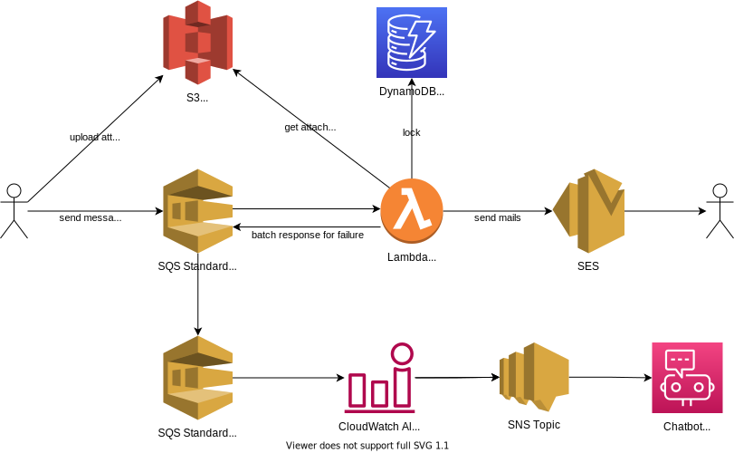

# mail-queues

## What is

Service to send emails using AWS SES with scaling by SQS.

These resources are created by the AWS CDK without AWS SES. This service sends mails using the domain and addresses of your SES.

## Architecture Diagram



## Preparation

### Creation of AWS SES

**AWS SES must be created in advance by you.**

### Parameter Change

Change parameters for this service in [cdk.json](./cdk.json).

- cdk.json
  - context
    - region
    - slackWorkspaceId
    - slackChannelId
    - senderAddress
      - This service sends mails using this email address.
      - **Using your AWS SES domains and email addresses.**

## Deploy

- `npx cdk deploy`

## How to use

- Check **SQS URL** in CloudFormation Output after deployment.
- Use aws-sdk or aws-cli to send messages to SQS.
  - Then this service starts and the mail sending process runs.
  - The message format is described below.

## Attached File

- **Before** sending a message to this service (SQS), **Attached Files must be uploaded to S3 separately (by yourself or users).**
  - **This allows attachments larger than the SQS client's maximum message size!**
  - The S3 Bucket is created in this CDK stack.
  - Directory and file paths of the attached files on S3 : `(mailKey)/(filename)`
    - ex) 1636220209-101/test1.png
    - See below for the **mailKey** in above directory name.

## JSON format for messages to SQS endpoints

Your application needs to send messages to SQS based on the following json format.

(When sending attached files, upload them to S3 first.)

### Key

- **mailKey** : string
  - Key to ensure uniqueness of mail
    - a (mailKey + toAddress) value to deduplicate mail through this service.
    - **Define rules for mailKey on your application side.**
      - ex) (timestamp)-(userID)
  - **The mailKey must be the name of the directory (prefix) from which attached files are uploaded to S3.**
    - ex) **1636220209-101**/test1.png
- subject : string
  - Subject of the email.
- body : string
  - Body message of the email.
- toAddress : string
  - Destination email address.
- attachedFileKeys : string[]
  - Attached file name. Multiple file names can be specified.
    - The `(filename)` part of `(mailKey)/(filename)`
    - Do not include the directory part (mailKey).
  - **If the name is not the same as the one uploaded to S3, an error will occur.**
  - If there are no attached files, this key does not need to be specified.
    - no key or an empty array value.

### Sample

```json
{
  "mailKey": "1636220209-101",
  "subject": "This is subject.",
  "body": "This is body.\nOK.\n\nThank you.",
  "toAddress": "to_address@example.com",
  "attachedFileKeys": ["test1.png", "test2.png"]
}
```
